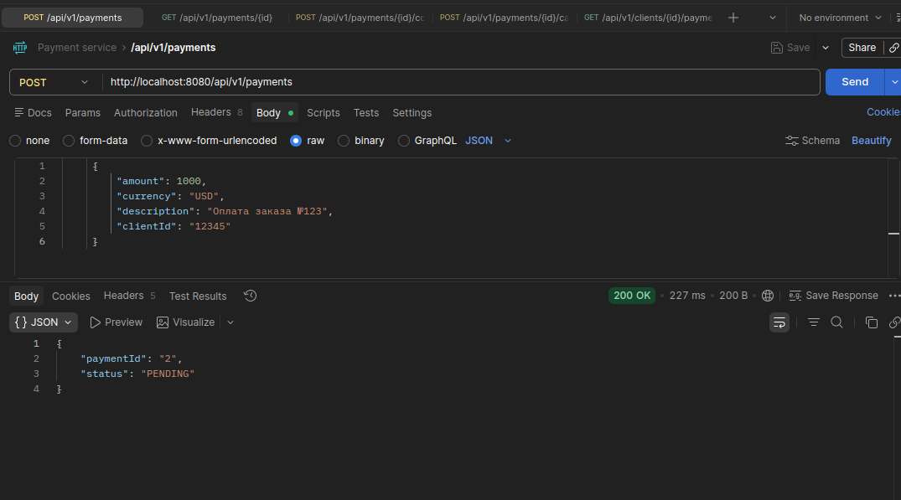
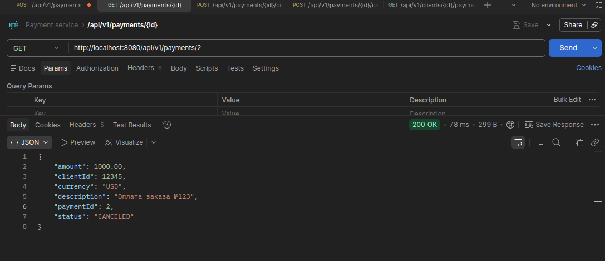
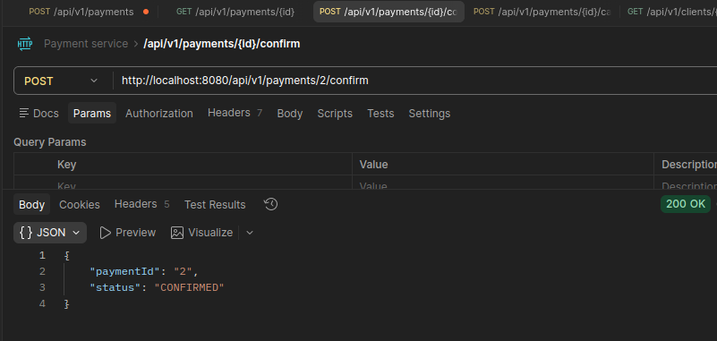
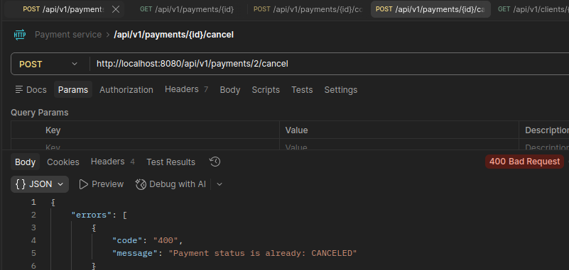
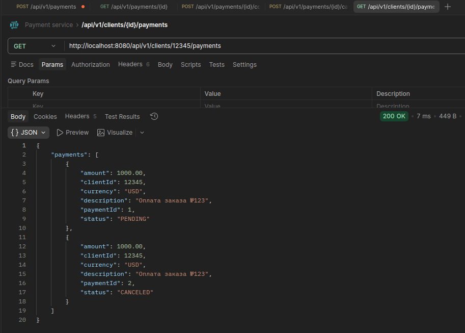
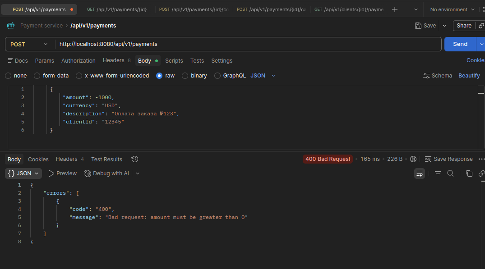
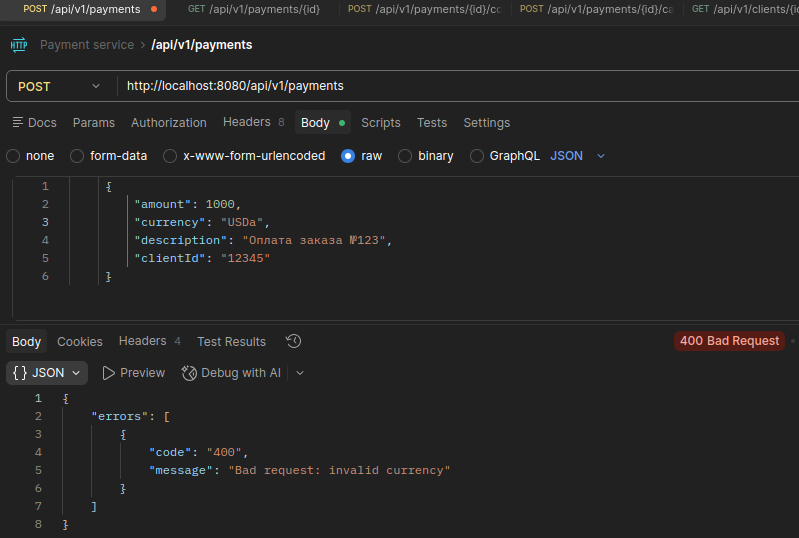
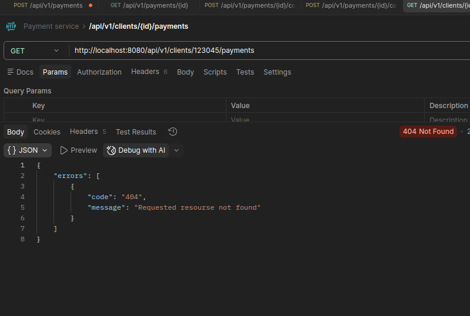

Инструкции по запуску

1. Клонировать репозиторий
2. cd в корень проекта
3. поднимаем бд. выполнить команду: docker compose up
   *убедитесь что докер установлен и запущен*
4. билд проекта, выполнить команду в втором табе терминала:
   ./gradlew clean build  
   Или в intelij idea clean build
5. Запуск проекта

Примеры api

1. POST /api/v1/payments - создание платежа
   

2. GET /api/v1/payments/{id} - получение платежа по id
   

3. POST /api/v1/payments/{id}/confirm - подтверждение платежа
   

4. POST /api/v1/payments/{id}/cancel - отмена платежа
   

5. GET /api/v1/clients/{id}/payments - получение всех платежей клиента
   

7. Валидация данных и обработка ошибок реализованна для ВСЕХ ендпоинтов. Пару примеров:  
   amount не положительный
   

валюта не валидная

клиент не найден

и так далее. 